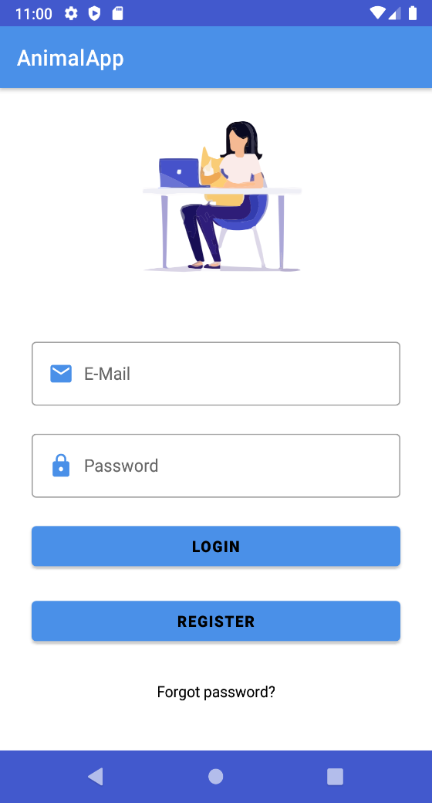
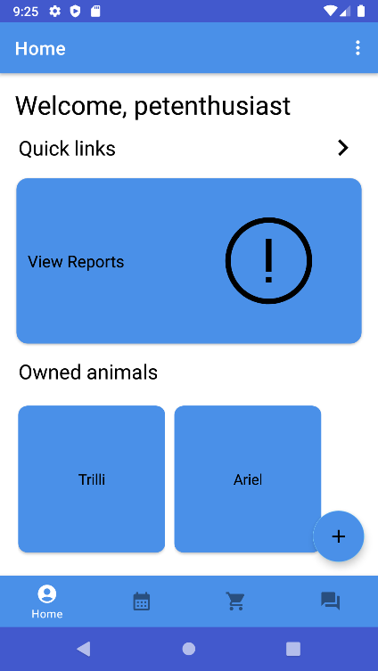
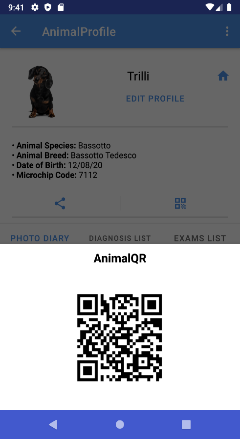
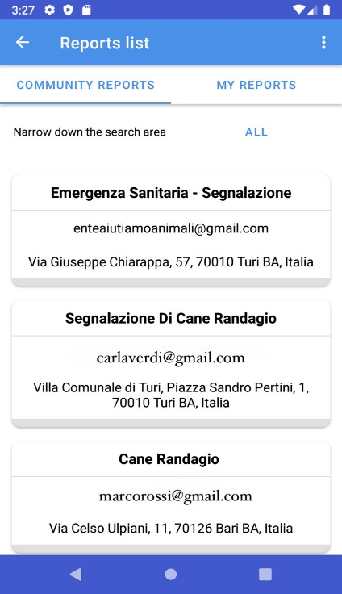
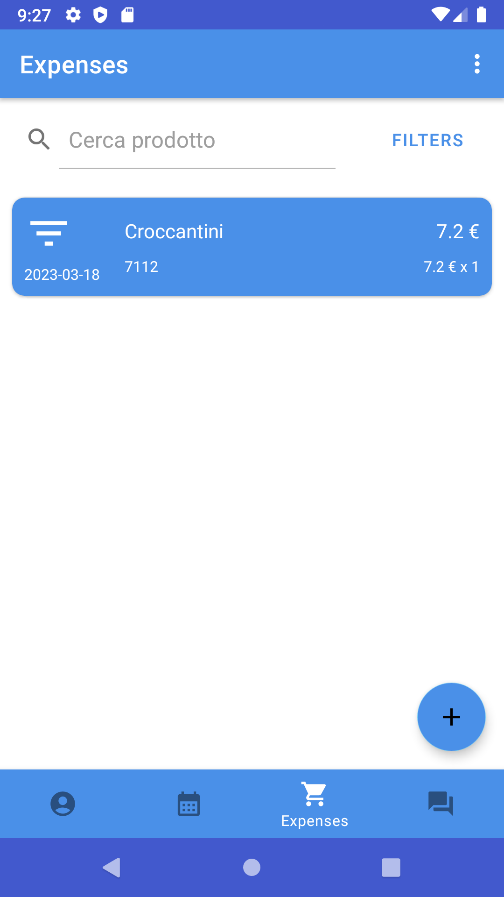
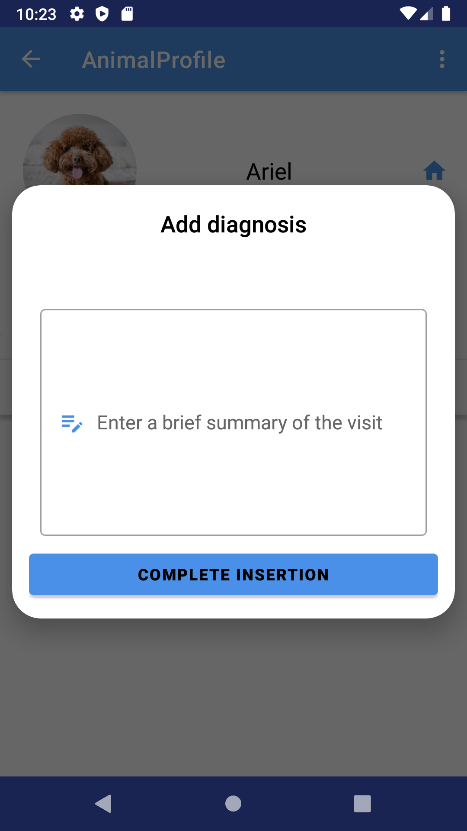

<div align="center">


# AnimalApp

### Progetto universitario — Esame di **Sviluppo di mobile software**

**Corso di Laurea in Informatica e Tecnologie per la Produzione del Software**  
Università degli Studi di Bari Aldo Moro — Dipartimento di Informatica

</div>

---

## 📌 Descrizione

**AnimalApp** è un'applicazione Android progettata come punto d'incontro tra proprietari di animali, veterinari ed enti pubblici o privati.

L'obiettivo del progetto è supportare la gestione quotidiana degli animali domestici, centralizzando informazioni sanitarie, spese, contenuti multimediali, segnalazioni e richieste all'interno di un'unica applicazione mobile.

Il progetto è stato realizzato come lavoro di gruppo per l'esame di **Sviluppo di mobile software**.

## 👥 Team

- **Sonia Auciello**
- Andrea Catacchio
- Luigi Dicataldo
- Simone Tibaldi

**Team di progetto:** Digitech

---

## ✨ Funzionalità principali

L'applicazione prevede tre categorie principali di utenti:

- **Appassionato / proprietario di animali**
- **Veterinario**
- **Ente pubblico o privato**

Funzionalità implementate:

- registrazione, login, logout e recupero password;
- gestione dei profili utente;
- inserimento, visualizzazione e modifica degli animali;
- associazione dell'animale a un veterinario;
- diario fotografico e gestione dei contenuti multimediali;
- condivisione dei dati pubblici dell'animale;
- generazione di **QR Code**;
- gestione delle segnalazioni relative ad animali;
- visualizzazione della posizione delle segnalazioni;
- gestione delle spese per animale;
- ricerca e filtraggio delle spese;
- inserimento e gestione di diagnosi ed esami da parte del veterinario;
- gestione di richieste e offerte;
- importazione di animali per gli enti;
- modalità **PokAnimal** per creare collegamenti tra animali.

---

## 🛠️ Tecnologie utilizzate


### Stack e librerie

- **Java**
- **Android Studio**
- **Firebase Authentication**
- **Cloud Firestore**
- **Firebase Storage**
- **SQLite** per la persistenza locale
- **Material Design**
- **Android Navigation**
- **ZXing** per i QR Code
- **Glide** per la gestione delle immagini
- **Gson**
- **Volley**
- **osmdroid**
- **uCrop / image editing**

Configurazione del progetto presente nel repository:

- `compileSdk 33`
- `targetSdk 33`
- `minSdk 26`
- Java 8

---

## 🧱 Struttura del progetto

```text
app/src/main/java/it/uniba/dib/sms22245/
├── adapters/
├── database/
├── entities/
├── tasks/
│   ├── common/
│   ├── login/
│   ├── organization/
│   ├── passionate/
│   └── registration/
└── ...
```

L'applicazione utilizza Firebase per le funzionalità online e SQLite per la persistenza locale.

---

## 📱 Screenshot

| Login | Home | QR Code |
|---|---|---|
|  |  |  |

| Segnalazioni | Spese | Diagnosi |
|---|---|---|
|  |  |  |

---

## 🚀 Come eseguire il progetto

### Requisiti

- Android Studio
- Android SDK API 33
- dispositivo o emulatore Android con **API 26 o superiore**
- progetto Firebase per le funzionalità online

### Installazione

1. Scaricare o clonare il repository.
2. Aprire **Android Studio**.
3. Selezionare **File → Open**.
4. Selezionare la cartella principale `AnimalApp`.
5. Attendere la sincronizzazione Gradle.
6. Configurare Firebase seguendo [`FIREBASE_SETUP.md`](FIREBASE_SETUP.md).
7. Collegare un dispositivo Android oppure avviare un emulatore.
8. Premere **Run** per avviare l'applicazione.

---

## 🔥 Configurazione Firebase

Per sicurezza, la versione pubblica non include `google-services.json`, token Firebase o credenziali di test.

Consulta:

➡️ [`FIREBASE_SETUP.md`](FIREBASE_SETUP.md)

---

## 📚 Documentazione

Il repository contiene anche il materiale prodotto per l'esame:

- [`Documentazione completa`](docs/Documentazione_AnimalApp.docx)
- [`Manuale utente`](docs/Manuale_Utente_AnimalApp.docx)
- [`Database`](docs/Database_AnimalApp.docx)
- [`Progettazione dell'icona`](docs/Progettazione_Icona_AnimalApp.docx)
- [`Screenshot significativi`](docs/Screenshot_significativi_AnimalApp.docx)
- [`Presentazione v1`](docs/Presentazione_AnimalApp_v1.pptx)
- [`Presentazione v2`](docs/Presentazione_AnimalApp_v2.pptx)

---

## 🎓 Contesto accademico

**Esame:** Sviluppo di mobile software  
**Corso di Laurea:** Informatica e Tecnologie per la Produzione del Software  
**Dipartimento:** Informatica  
**Università:** Università degli Studi di Bari Aldo Moro

---

## ℹ️ Note

Questo repository raccoglie un progetto universitario sviluppato in gruppo.

La versione pubblica è stata ripulita da cache Gradle, file locali di Android Studio, configurazioni Firebase specifiche e credenziali di test.
